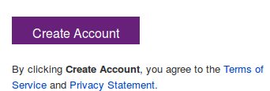

## Overview

[GitHub](https://github.com/) gives you unlimited *public* space for free. What if you have a private project, you don't really want to or it is not an option for you to put that source code in a public GitHub? I am going to tell you that you can have unlimited *private* Git space too. Except the space is going to come from the Microsoft, and not from the GitHub.com.

You might ask: *Do I have to use Visual Studio to get free unlimited private Git space?* **NO!**

Here are the steps:

1. Sign up for a free [Visual Studio Online](https://www.visualstudio.com) account.

* Click on the green button under the "Visual Studio Online" text.  
  

* You will be directed to a Microsoft Account Login area. If you already have a hotmail or Microsoft Live account you can login there, or you can create a new account by clicking the "Sign Up Now" link at the bottom-right corner of the screen:  
  

* If you are creating a new account, you will be redirected to [signup.live.com](https://signup.live.com):  
  

* On the next screen you will need to 

    * fill in your full name, 
    * pick an *account* name for your Git repository URL, the URL will be like "https://<an_account>.visualstudio.com"
    * then click the "Create Account" button:  
  

* On the next screen, you will prompted to create your first project. This is where you create your first Git repository. Be sure to check the **Git** option in the repository type:  

* Click the **Create Project** button to complete the Git Repository Creation. You should see a new repository being created.  

* **Create New Repository**: Click "New Repository" to create a new repository, you can click on the top-left corner "Project1" (or your Project Name) to see a dropdown menu being displayed:  

* Once your new repository is created, a screen is displayed allowing you to generate git credentials.  

* Alternatively, you can click on the "Step-by-Step" link at the bottom of the page to get a set of commands to clone or push to the Git repository you have just created.  

